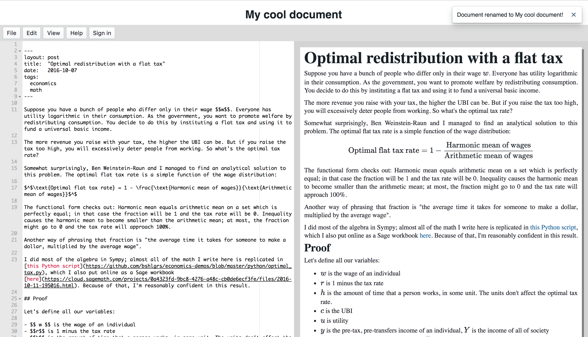

## markdown editor

This is a Markdown/LaTeX editor, similar to what [dillinger.io](http://dillinger.io) is for Markdown. Here's what it looks like, as of 2017-01-31:

The frontend is deployed at [docs.shlegeris.com](http://docs.shlegeris.com/)

Here's my idea for this web app: When I got to university, I wanted to be able to use LaTeX
for my math assignments. But it was inconvenient and annoying to have to learn to use a whole new set of word processing
software. Also, LaTeX is quite heavyweight. I'd much rather write in Markdown most of the time.

That said, it really is very hard and annoying to typeset math nicely without LaTeX. So the students actually need a solution for this.

This project attempts to make it easy to use advanced math typesetting abilities from LaTeX without them having to jump all the way in,
by mostly being a Markdown editor but having LaTeX built in.

I spent a few hours working on the frontend. It's pretty simple--I use the Ace editor, which is a pretty fully featured JS code editor.
This is then translated to Markdown and LaTeX on the right hand column.

## Things needed for an MVP

- A backend
    - Auth
    - Storing documents
- Export to LaTeX/PDF/HTML
- Finish up the various menus in the UI
- Useful help menus
    - under "Help with markdown" link to a tutorial
    - under "Help with LaTeX" link to, among other things, [detexify](http://detexify.kirelabs.org/classify.html)

## Stretch features

- Images

## notes

- check out whether CodeMirror is actually better for markdown than Ace is. I suspect it might be
- maybe make the CSS output use Computer Modern
